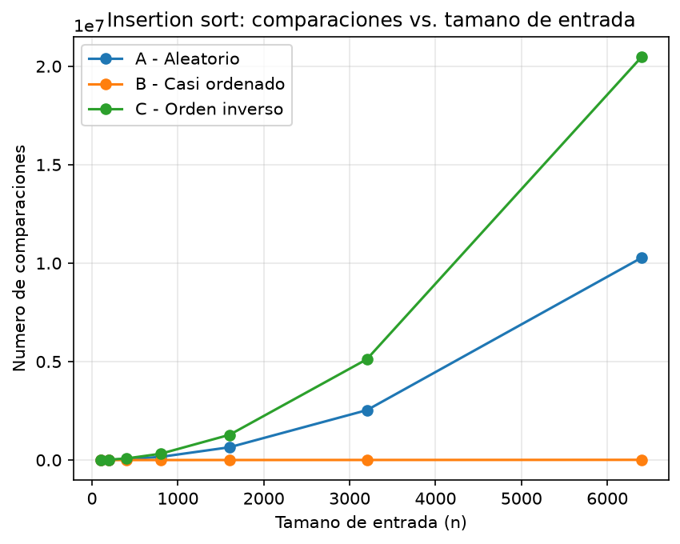
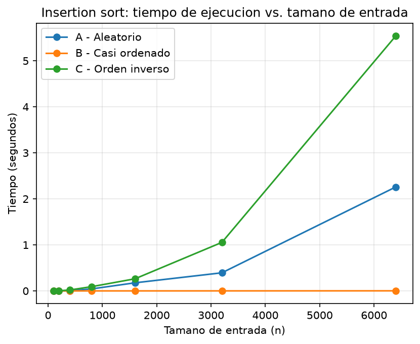

# Laboratorio evaluativo 01 — Fundamentos, complejidad y recurrencias

**Nombre completo:** DAVID MORALES VARGAS

## Instrucciones para reproducir el experimento

1. Crear el entorno virtual dentro de la raíz del proyecto
    ```bash
    python -m venv venv
    ```

    ó

    ```bash
    py -m venv venv
    ```
2. Ubicados ya en la raíz del repositorio se activa el entorno virtual:
   - `source venv/bin/activate`(Linux/macOS)
   - `venv\Scripts\activate` (Windows)
3. Instalar las dependencias:
   ```
   pip install -r requirements.txt
   ```
4. Ingresar a la carpeta del laboratorio evaluativo:
   ```
   cd laboratorios/lab1-fundamentos-complejidad-recurrencias
   ```
5. Ejecutar cada ejercicio desde este laboratorio (parte3_casos.py y parte4_complejidad.py):
   - **Parte 3** (genera `graficas/parte3_comparaciones.png` y `graficas/parte3_tiempo.png`):
     ```
     py parte3_casos.py
     ```
   - **Parte 4** (genera `graficas/parte4_tiempo.png`):
     ```
     py parte4_complejidad.py
     ```

    También se puede desactivar el entorno virtual (en caso de ser necesario)

    ```bash
    deactivate
    ```
    ---

## Parte 1 — Analizar el algoritmo antes de comprar hardware

Concluir instantáneamente que el problema se resuelve duplicando la velocidad de servidor es lo equivalente a elegir un lenguaje de programación o framework solo porque es lo más nuevo en el mercado. Para casos como este se debe analizar múltiples puntos de vista, incluyendo el algoritmo, ya que un algoritmo puede funcionar a la perfección y entregar el resultado que se desea, pero eso no significa que sea eficiente frente a la ventana de tiempo no negociable de 4 horas que se debe respetar. El algoritmo fue hecho para una cantidad de registros diferentes, siendo estos de mucha menor cantidad, y al haber un crecimiento tan alto entonces se llega a concluir que no es el adecuado para tal tarea y se deben evaluar otras opciones.

El algoritmo insertion soft por su naturaleza tiene una complejidad algorítmica, que, en el peor caso, llega a ser un cuadrado de n (n siendo la cantidad de registros que llegan) por lo que significa que mientras peor lleguen los registros, como si vinieran en el peor caso posible, entonces el tiempo que tarda dicho algoritmo en resolver su tarea puede llegar hasta cuadruplicarse, pues esa idea de que si duplicamos la velocidad entonces se reducirá el tiempo de ejecución solo es una idea pasajera por no ver las posibles entradas que los datos pueden entregar. Esa es la principal razón por la que el sistema colapsa, ya que la idea de que mejora el tiempo de ejecución es algo pasajero, entonces indiferentemente de lo bueno que hayan comprado el hardware del servidor se llegará al mismo problema: tiempo insuficiente por tiempo de ejecución excesivamente alto.

Con un problema de este estilo, no se puede suponer fallos y soluciones sin verificar toda la trazabilidad de lo que está sucediendo. Si se fuera a tomar soluciones como las que la secretaria de Educación propone, de directamente concluir que es el servidor, entonces eso reflejará perdidas monetarias y de tiempo mayores a las que se sufrían antes, no por la cantidad que se le agrego al servidor, sino por no analizar donde estaba exactamente el problema.

Una vez, como programador, experimenté un problema similar al que sufre el software de Tamiza. Como practicante en un hospital tuve la oportunidad de apoyar en el proceso de pruebas de laboratorio, lo cual un bot de Python tenía un algoritmo para sacar las pruebas de laboratorio de todos los pacientes cada día a las 7 de la mañana. El problema es que, si bien el algoritmo sacaba todas las pruebas y las mandaba a la base de datos correctamente, lo hacía muy lento y se pasaba de la hora incluso a mostrar datos a partir de las 12 PM, entonces a los doctores se les entregaban pruebas con datos que al final no reflejaban una correcta trazabilidad del paciente en el día anterior. Se estaba viendo la posibilidad de cambiar el algoritmo para que entregará los datos en el tiempo estimado por el hospital.

---

## Parte 2 — Responsabilidad ambiental y ética de la implementación

Ya se vio en el punto anterior como una mala decisión, por no mirar todo el punto de vista del programa, puede tener consecuencias desagradables. Al tomar una conclusión tan precipitada y duplicar la velocidad del servidor hará que tarde mucho más tiempo el ordenamiento (que conlleve a que el servidor colapse) de la lista para priorizar a los pacientes, o simplemente el hecho de usar un algoritmo que tarde más que otro, lo que se traduce directamente a muchos más recursos que se le deben exigir al servidor para que procese eso día tras día, semana tras semana, mes tras mes, años tras año. Como el algoritmo es ineficiente para este proceso por el tiempo tan exagerado que toma completar su tarea entonces eso afecta directamente al consumo energético, lo que es directamente proporcional a una huella de carbono injustificada y que tenga un mayor impacto negativo ambientalmente hablando. No solo las personas y el servidor sufren, también los recursos naturales que se usan para poder operar esos procedimientos computacionales.

Ya tomamos en cuenta un impacto ambiental que puede sufrir por la mala implementación del algoritmo en la situación actual de la plataforma Tamiza. Ahora, diariamente se puede sufrir dentro de la organización de Salud por esa demora, ya que el algoritmo también puede llegar a fallar y dar datos incompletos que no se debería dejar pasar por alto. Existen varias personas afectadas por este error, pero se puede destacar principalmente a dos actores: el operador de centro de contacto y al paciente. Al necesitar de una lista incompleta y sin un orden hace que el personal de ese servicio trabaje de una forma muy desorganizada, con mala priorización y se seguro realizando trabajo no correspondiente a sus labores, esto sin contar probablemente quejas por partes de los pacientes y problemas internos por errores que se pueden cometer. Por otro lado, el paciente sufre excesivamente también por este error, y que si no se tiene una priorización correcta y por orden de quien debe ser atendido primero causa directamente que una persona no sea contactada a tiempo para su cita, y eso es un riesgo médico y grave que debe asumir el mismo paciente, ya que, de todas formas, no podrá ser atendido. Los tiempos de espera van a aumentar para las personas que realmente necesitan una atención más inmediata. Por algo más secundario, está la secretaria de Salud que tiene que realizar pagos excesivos y demás por la mala implementación de un algoritmo, y el equipo de desarrollo que debe trabajar tiempos extras resolviendo problemas relacionados también a dicho tema.

Por todo lo anterior, y más allá del tiempo que el servidor va a gastar en la ejecución del algoritmo y el tiempo de más que la personas que trabajen en esa organización deben usar, se está hablando de un software médico, que son aplicativos más delicados con el funcionamiento que deben implementar. Al momento de que un algoritmo se demore más de lo que debería no solo es pérdida de dinero por parte de la empresa, por parte de los trabajadores con cosas extras que deben hacer, sino que directamente se está manejando un tema con la priorización de los pacientes. Hay pacientes que deben ser atendidos urgentemente, y tienen más problemas que otros, de ahí la priorización que se hace, entonces un error con la ejecución puede ser vital para una persona que debe ser atendida, eso es un fallo critico en el sistema de salud, y reglas de calidad que no se están cumpliendo.

---

## Parte 3 — Peor caso, mejor caso y caso promedio, demostrados en Python

Código de esta parte: [código de la Parte 3](parte3_casos.py)

### 3.1 Explicación

**Definición de casos** (implementadas mediante [`insertion_sort`](algoritmos.py) sobre los lotes generados en [`datos.py`](datos.py)):

- **Mejor caso:** La mejor entrada para un algoritmo de Insertion Soft. Ocurre cuando la entrada de registros viene, en su gran mayoría, ya ordenado y solo habiendo que ordenar unos pocos registros. Entonces el trabajo es lineal por parte del ciclo externo, y el ciclo interno en mínimas ocasiones se ejecuta.
- **Caso promedio:** Un caso donde los registros vienen de forma aleatorio, siendo este el caso más normal que se puede ocurrir. Teóricamente, viniendo los registros en promedio desordenados entonces dependiendo el tamaño n de entrada de datos tiene como consecuencia n/2 (la mitad) de veces que se ejecutaría el ciclo interno de Insertion Doft.
- **Peor caso:** La peor entrada posible para un algoritmo de ordenamiento de Insertion Soft, ya que, el ordenamiento que se supone que debe tener los registros (digamos que de menor a mayor) tiene un orden inverso al que se supone que debería estar (quiere decir, de mayor a menor). Esto tiene como consecuencia que el algoritmo de ordenamiento deba recorrer toda la lista de registros en su ciclo externo y por cada elemento también deba recorrer el ciclo interno. Computacionalmente más caro y demorado que los otros dos casos.

**¿Cuál caso usar para decidir si el algoritmo entra a producción?**

R/ Teniendo en cuenta las restricciones proporcionadas, la longitud de los registros y los casos posibles que pueden llegar dichos resultados me inclinaría por tomar el Caso C – Orden Inverso para decidir si entra a producción. Esto se debe a que, nos dan la posibilidad innegable de que los registros pueden llegar a ser así (no es una teoría, es la realidad), con una ventana tan pequeña de tiempo y haciendo el trabajo con datos tan sensibles como lo son registros médicos, que por pequeñas equivocaciones la salud de personas puede estar involucradas, entonces habrá que tomar como referencia la peor forma en la que pueden llegar los datos para asegurar una calidad en el servicio optima, sin fallos. Así, asegurando la calidad de servicio en el peor caso, entonces también con los casos promedio y mejor caso también se podrán trabajar sin problema.

**Predicción antes de medir (escenarios de Tamiza para insertion sort):**

El escenario de plataforma Tamiza nos concede tres posibles casos que puede llegar el 1.200.000 de registros al día. Los casos son:

- **Caso A:** Es un orden aleatorio, que también podemos llamar Promedio, ya que no hay una forma específica en la que los registros pueden llegar ya que lo hacen en el orden de laboratorio. Esto es un caso ni tan bueno, ni tan malo, lo que puede pasar es que los registros tengan que recorrerse la mitad del tamaño, que en este caso es 1.200.000 registros.
- **Caso B:** Los registros llegan en un orden casi perfecto. En su mayoría, ya todos están ordenados y hay que realizar el recorrido en pocos elementos del día anterior, lo que quiere decir un recorrido más bien lineal de toda la lista. Este es el mejor caso que puede aparecer.
- **Caso C:** El peor caso posible con el que puede llegar los registros, y un posible candidato perfecto a la ineficiencia del algoritmo. Los registros al estar en un orden inverso nos obligan a ordenarlo uno a uno, por lo que el recorrido y el desplazamiento de los elementos se hacen para cada uno de ellos. Es el peor caso.

### 3.2 Demostración experimental





**¿Qué escenario resultó siendo el peor, el mejor y cuál se aproxima más al promedio?**

Cómo se puede ver en la gráfica, el caso C terminó siendo el peor caso, el caso B es el más cercano al promedio y el caso A terminó siendo el mejor caso posible. Esto respaldando la teoría:

- **Caso C:** Para el caso donde se debe ordenar todo el algoritmo por el orden inverso se necesitó de más de 20 millones de comparaciones para un n igual a 6400, y entre todas esas comparaciones la maquina tardó casi 6 segundos en ejecutarlo por completo.
- **Caso B:** Para el caso promedio, como viene en un orden aleatorio, entonces el ordenamiento se debe hacer con varios de los elementos de la lista, lo que da un total de comparaciones de más de 10 millones y un total de casi 3 segundos. Como se mencionó anteriormente, el número de desplazamientos es de n/2, por lo que cumple correctamente.
- **Caso A:** La mejor opción para ordenar, ya que vienen en un 98% ordenados todos los registros. Para este caso, solo se necesito de poco más de 10 mil comparaciones y menos de un segundo de ejecución. Efectivamente se puede ver, que, aunque la n sigue siendo la misma, la cantidad de operaciones internas disminuye tanto que no hace un gasto tan exagerado.

La predicción que se realizó para el ejercicio fue que, el peor caso posible iba a ser el Caso C por la naturaleza de que se debe pasar elementos tras elementos ejecutando los ciclos interno y externo. En la práctica, esta predicción se cumplió correctamente, ya que las métricas lanzadas por el script coinciden con que el mayor esfuerzo de la máquina (por comparaciones) y el mayor tiempo que se demoró la ejecución en todos los casos es superior que el caso A y B.

---
