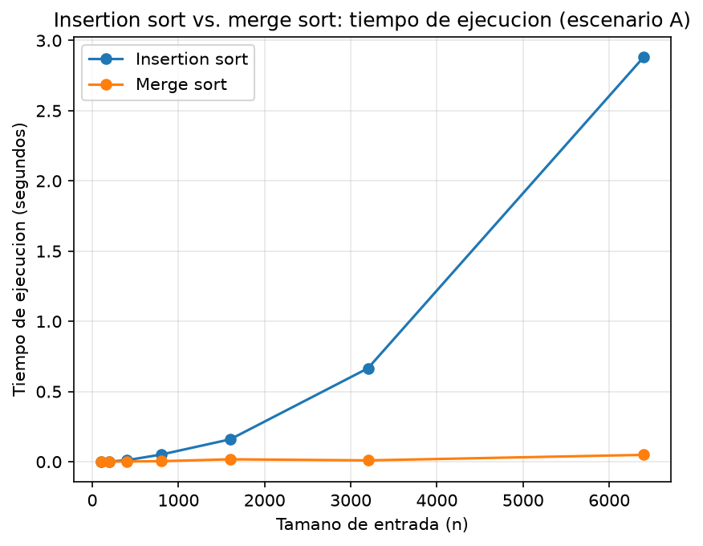

# Laboratorio evaluativo 01 — Fundamentos, complejidad y recurrencias

**Nombre completo:** DAVID MORALES VARGAS

## Instrucciones para reproducir el experimento

1. Crear el entorno virtual dentro de la raíz del proyecto
    ```bash
    python -m venv venv
    ```

    ó

    ```bash
    py -m venv venv
    ```
2. Ubicados ya en la raíz del repositorio se activa el entorno virtual:
   - `source venv/bin/activate`(Linux/macOS)
   - `venv\Scripts\activate` (Windows)
3. Instalar las dependencias:
   ```
   pip install -r requirements.txt
   ```
4. Ingresar a la carpeta del laboratorio evaluativo:
   ```
   cd laboratorios/lab1-fundamentos-complejidad-recurrencias
   ```
5. Ejecutar cada ejercicio desde este laboratorio (parte3_casos.py y parte4_complejidad.py):
   - **Parte 3** (genera `graficas/parte3_comparaciones.png` y `graficas/parte3_tiempo.png`):
     ```
     py parte3_casos.py
     ```
   - **Parte 4** (genera `graficas/parte4_tiempo.png`):
     ```
     py parte4_complejidad.py
     ```

    También se puede desactivar el entorno virtual (en caso de ser necesario)

    ```bash
    deactivate
    ```
    ---

## Parte 1 — Analizar el algoritmo antes de comprar hardware

Concluir instantáneamente que el problema se resuelve duplicando la velocidad de servidor es lo equivalente a elegir un lenguaje de programación o framework solo porque es lo más nuevo en el mercado. Para casos como este se debe analizar múltiples puntos de vista, incluyendo el algoritmo, ya que un algoritmo puede funcionar a la perfección y entregar el resultado que se desea, pero eso no significa que sea eficiente frente a la ventana de tiempo no negociable de 4 horas que se debe respetar. El algoritmo fue hecho para una cantidad de registros diferentes, siendo estos de mucha menor cantidad, y al haber un crecimiento tan alto entonces se llega a concluir que no es el adecuado para tal tarea y se deben evaluar otras opciones.

El algoritmo insertion soft por su naturaleza tiene una complejidad algorítmica, que, en el peor caso, llega a ser un cuadrado de n (n siendo la cantidad de registros que llegan) por lo que significa que mientras peor lleguen los registros, como si vinieran en el peor caso posible, entonces el tiempo que tarda dicho algoritmo en resolver su tarea puede llegar hasta cuadruplicarse, pues esa idea de que si duplicamos la velocidad entonces se reducirá el tiempo de ejecución solo es una idea pasajera por no ver las posibles entradas que los datos pueden entregar. Esa es la principal razón por la que el sistema colapsa, ya que la idea de que mejora el tiempo de ejecución es algo pasajero, entonces indiferentemente de lo bueno que hayan comprado el hardware del servidor se llegará al mismo problema: tiempo insuficiente por tiempo de ejecución excesivamente alto.

Con un problema de este estilo, no se puede suponer fallos y soluciones sin verificar toda la trazabilidad de lo que está sucediendo. Si se fuera a tomar soluciones como las que la secretaria de Educación propone, de directamente concluir que es el servidor, entonces eso reflejará perdidas monetarias y de tiempo mayores a las que se sufrían antes, no por la cantidad que se le agrego al servidor, sino por no analizar donde estaba exactamente el problema.

Una vez, como programador, experimenté un problema similar al que sufre el software de Tamiza. Como practicante en un hospital tuve la oportunidad de apoyar en el proceso de pruebas de laboratorio, lo cual un bot de Python tenía un algoritmo para sacar las pruebas de laboratorio de todos los pacientes cada día a las 7 de la mañana. El problema es que, si bien el algoritmo sacaba todas las pruebas y las mandaba a la base de datos correctamente, lo hacía muy lento y se pasaba de la hora incluso a mostrar datos a partir de las 12 PM, entonces a los doctores se les entregaban pruebas con datos que al final no reflejaban una correcta trazabilidad del paciente en el día anterior. Se estaba viendo la posibilidad de cambiar el algoritmo para que entregará los datos en el tiempo estimado por el hospital.

---

## Parte 2 — Responsabilidad ambiental y ética de la implementación

Ya se vio en el punto anterior como una mala decisión, por no mirar todo el punto de vista del programa, puede tener consecuencias desagradables. Al tomar una conclusión tan precipitada y duplicar la velocidad del servidor hará que tarde mucho más tiempo el ordenamiento (que conlleve a que el servidor colapse) de la lista para priorizar a los pacientes, o simplemente el hecho de usar un algoritmo que tarde más que otro, lo que se traduce directamente a muchos más recursos que se le deben exigir al servidor para que procese eso día tras día, semana tras semana, mes tras mes, años tras año. Como el algoritmo es ineficiente para este proceso por el tiempo tan exagerado que toma completar su tarea entonces eso afecta directamente al consumo energético, lo que es directamente proporcional a una huella de carbono injustificada y que tenga un mayor impacto negativo ambientalmente hablando. No solo las personas y el servidor sufren, también los recursos naturales que se usan para poder operar esos procedimientos computacionales.

Ya tomamos en cuenta un impacto ambiental que puede sufrir por la mala implementación del algoritmo en la situación actual de la plataforma Tamiza. Ahora, diariamente se puede sufrir dentro de la organización de Salud por esa demora, ya que el algoritmo también puede llegar a fallar y dar datos incompletos que no se debería dejar pasar por alto. Existen varias personas afectadas por este error, pero se puede destacar principalmente a dos actores: el operador de centro de contacto y al paciente. Al necesitar de una lista incompleta y sin un orden hace que el personal de ese servicio trabaje de una forma muy desorganizada, con mala priorización y se seguro realizando trabajo no correspondiente a sus labores, esto sin contar probablemente quejas por partes de los pacientes y problemas internos por errores que se pueden cometer. Por otro lado, el paciente sufre excesivamente también por este error, y que si no se tiene una priorización correcta y por orden de quien debe ser atendido primero causa directamente que una persona no sea contactada a tiempo para su cita, y eso es un riesgo médico y grave que debe asumir el mismo paciente, ya que, de todas formas, no podrá ser atendido. Los tiempos de espera van a aumentar para las personas que realmente necesitan una atención más inmediata. Por algo más secundario, está la secretaria de Salud que tiene que realizar pagos excesivos y demás por la mala implementación de un algoritmo, y el equipo de desarrollo que debe trabajar tiempos extras resolviendo problemas relacionados también a dicho tema.

Por todo lo anterior, y más allá del tiempo que el servidor va a gastar en la ejecución del algoritmo y el tiempo de más que la personas que trabajen en esa organización deben usar, se está hablando de un software médico, que son aplicativos más delicados con el funcionamiento que deben implementar. Al momento de que un algoritmo se demore más de lo que debería no solo es pérdida de dinero por parte de la empresa, por parte de los trabajadores con cosas extras que deben hacer, sino que directamente se está manejando un tema con la priorización de los pacientes. Hay pacientes que deben ser atendidos urgentemente, y tienen más problemas que otros, de ahí la priorización que se hace, entonces un error con la ejecución puede ser vital para una persona que debe ser atendida, eso es un fallo critico en el sistema de salud, y reglas de calidad que no se están cumpliendo.

---

## Parte 3 — Peor caso, mejor caso y caso promedio, demostrados en Python

Código de esta parte: [código de la Parte 3](parte3_casos.py)

### 3.1 Explicación

**Definición de casos** (implementadas mediante [`insertion_sort`](algoritmos.py) sobre los lotes generados en [`datos.py`](datos.py)):

- **Mejor caso:** La mejor entrada para un algoritmo de Insertion Soft. Ocurre cuando la entrada de registros viene, en su gran mayoría, ya ordenado y solo habiendo que ordenar unos pocos registros. Entonces el trabajo es lineal por parte del ciclo externo, y el ciclo interno en mínimas ocasiones se ejecuta.
- **Caso promedio:** Un caso donde los registros vienen de forma aleatorio, siendo este el caso más normal que se puede ocurrir. Teóricamente, viniendo los registros en promedio desordenados entonces dependiendo el tamaño n de entrada de datos tiene como consecuencia n/2 (la mitad) de veces que se ejecutaría el ciclo interno de Insertion Doft.
- **Peor caso:** La peor entrada posible para un algoritmo de ordenamiento de Insertion Soft, ya que, el ordenamiento que se supone que debe tener los registros (digamos que de menor a mayor) tiene un orden inverso al que se supone que debería estar (quiere decir, de mayor a menor). Esto tiene como consecuencia que el algoritmo de ordenamiento deba recorrer toda la lista de registros en su ciclo externo y por cada elemento también deba recorrer el ciclo interno. Computacionalmente más caro y demorado que los otros dos casos.

**¿Cuál caso usar para decidir si el algoritmo entra a producción?**

R/ Teniendo en cuenta las restricciones proporcionadas, la longitud de los registros y los casos posibles que pueden llegar dichos resultados me inclinaría por tomar el Caso C – Orden Inverso para decidir si entra a producción. Esto se debe a que, nos dan la posibilidad innegable de que los registros pueden llegar a ser así (no es una teoría, es la realidad), con una ventana tan pequeña de tiempo y haciendo el trabajo con datos tan sensibles como lo son registros médicos, que por pequeñas equivocaciones la salud de personas puede estar involucradas, entonces habrá que tomar como referencia la peor forma en la que pueden llegar los datos para asegurar una calidad en el servicio optima, sin fallos. Así, asegurando la calidad de servicio en el peor caso, entonces también con los casos promedio y mejor caso también se podrán trabajar sin problema.

**Predicción antes de medir (escenarios de Tamiza para insertion sort):**

El escenario de plataforma Tamiza nos concede tres posibles casos que puede llegar el 1.200.000 de registros al día. Los casos son:

- **Caso A:** Es un orden aleatorio, que también podemos llamar Promedio, ya que no hay una forma específica en la que los registros pueden llegar ya que lo hacen en el orden de laboratorio. Esto es un caso ni tan bueno, ni tan malo, lo que puede pasar es que los registros tengan que recorrerse la mitad del tamaño, que en este caso es 1.200.000 registros.
- **Caso B:** Los registros llegan en un orden casi perfecto. En su mayoría, ya todos están ordenados y hay que realizar el recorrido en pocos elementos del día anterior, lo que quiere decir un recorrido más bien lineal de toda la lista. Este es el mejor caso que puede aparecer.
- **Caso C:** El peor caso posible con el que puede llegar los registros, y un posible candidato perfecto a la ineficiencia del algoritmo. Los registros al estar en un orden inverso nos obligan a ordenarlo uno a uno, por lo que el recorrido y el desplazamiento de los elementos se hacen para cada uno de ellos. Es el peor caso.

### 3.2 Demostración experimental


**¿Qué escenario resultó siendo el peor, el mejor y cuál se aproxima más al promedio?**

Cómo se puede ver en la gráfica, el caso C terminó siendo el peor caso, el caso B es el más cercano al promedio y el caso A terminó siendo el mejor caso posible. Esto respaldando la teoría:

- **Caso C:** Para el caso donde se debe ordenar todo el algoritmo por el orden inverso se necesitó de más de 20 millones de comparaciones para un n igual a 6400, y entre todas esas comparaciones la maquina tardó casi 6 segundos en ejecutarlo por completo.
- **Caso B:** Para el caso promedio, como viene en un orden aleatorio, entonces el ordenamiento se debe hacer con varios de los elementos de la lista, lo que da un total de comparaciones de más de 10 millones y un total de casi 3 segundos. Como se mencionó anteriormente, el número de desplazamientos es de n/2, por lo que cumple correctamente.
- **Caso A:** La mejor opción para ordenar, ya que vienen en un 98% ordenados todos los registros. Para este caso, solo se necesito de poco más de 10 mil comparaciones y menos de un segundo de ejecución. Efectivamente se puede ver, que, aunque la n sigue siendo la misma, la cantidad de operaciones internas disminuye tanto que no hace un gasto tan exagerado.

La predicción que se realizó para el ejercicio fue que, el peor caso posible iba a ser el Caso C por la naturaleza de que se debe pasar elementos tras elementos ejecutando los ciclos interno y externo. En la práctica, esta predicción se cumplió correctamente, ya que las métricas lanzadas por el script coinciden con que el mayor esfuerzo de la máquina (por comparaciones) y el mayor tiempo que se demoró la ejecución en todos los casos es superior que el caso A y B.

---

## Parte 4 — Complejidad de merge sort e insertion sort: cálculo y validación

Código de esta parte: [código de la Parte 4](parte4_complejidad.py) (usa [`merge_sort`](algoritmos.py) agregado a `algoritmos.py`)

### 4.1 Cálculo teórico

**Recurrencia de merge sort:** T(n) = 2T(n/2) + Θ(n)

Nos ayuda a medir el tiempo que puede demorar la ejecución de un algoritmo. En este caso, dicho tiempo total se representa con T(n), siendo n una variable dependiente, que es el tamaño de la entrada de la lista, y es directamente proporcional al tiempo de ejecución. Tiene los siguientes elementos:

- **2T(n/b):** T(n/b) se multiplica por dos porque es la cantidad de subproblemas que se dividirá el problema original. Esto quiero decir que, como el problema original (la lista a ordenar) será dividida en dos para ordenar sus partes por separados entonces por eso se debe multiplicar por dos. a = 2.
- **T(n/2):** Ya sabemos que el problema para el caso de merge soft se va a dividir en 2, eso quiere decir que, cada subproblema tiene la mitad de tamaño que tendrá el problema original. Por eso n/2. b = 2.
- **Θ(n):** Este representa el costo de unir todos los subproblemas de nuevo en el problema original (que se le llama "merge"). Como cada subproblema ya está ordenado, para volverlos a unir solo se requiere una pasada lineal sobre los n elementos, sin operaciones adicionales.

**Resolución por el método de sustitución:**

Adivinamos la formula de la solución. Suponemos que el tiempo de ejecución está acotado superiormente con nlogn. El planteamiento queda: T(n) ≤ c nlogn para una constante c > 0 y n>= n_0

Realizamos la sustitución cuando se cumple un subproblema más pequeño, específicamente n/2. Entonces se reemplaza T(n/2) y queda la conjetura de la siguiente forma:

T(n) ≤ 2(c (n/2)log(n/2)) + cn

Ahora se realiza la simplificación de la función:

- Se cancelan el dos multiplicando con el dos dividiendo: T(n) ≤ cnlog(n/2) + cn
- Aplicamos la propiedad de los logaritmos que dice que (log(a/b) = loga – logb), y queda: T(n) ≤ cn(logn – log2) + cn
- Como sabemos que log_2 2 = 1 entonces tenemos que: T(n) ≤ cn(logn – 1) + cn => T(n) ≤ cn logn – cn + cn
- Se realiza la resta de los términos iguales: T(n) ≤ cn logn

Resolviendo lo anterior, se puede notar que tiene la misma forma de la hipótesis que se realizó. Entonces queda demostrado que T(n) = O(n logn)

**Insertion sort línea a línea:**

```python
for i in range(1, len(arreglo)):         # c1, se ejecuta n veces
    clave = arreglo[i]                   # c2, se ejecuta n - 1 veces
    j = i - 1                            # c3, se ejecuta n - 1 veces

    while j >= 0:                        # c4, se ejecuta sum(t_i + 1) desde i=1 hasta n-1
        comparaciones += 1               # c5, se ejecuta sum(t_i) desde i=1 hasta n-1
        if arreglo[j] < clave:           # c6, se ejecuta sum(t_i) desde i=1 hasta n-1
            arreglo[j + 1] = arreglo[j]  # c7, se ejecuta sum(t_i) desde i=1 hasta n-1
            j -= 1                       # c8, se ejecuta sum(t_i) desde i=1 hasta n-1
        else:
            break                        # c9, se ejecuta a lo sumo n - 1 veces (una vez por cada corte anticipado)

    arreglo[j + 1] = clave               # c10, se ejecuta n - 1 veces
```

Sumando todos los términos agrupados, el tiempo total es:

**Complejidad algorítmica esperada:**

| Algoritmo | Mejor caso | Peor caso | Caso promedio |
|---|---|---|---|
| Insertion sort | Θ(n) | Θ(n²) | Θ(n²) |
| Merge sort | Θ(n log n) | Θ(n log n) | Θ(n log n) |

Para el caso de insertion soft: En el Peor y Caso promedio se ve una complejidad de n**2 ya que en ambos casos se deben realizar los dos ciclos del agoritmo, por lo que es recorrido y desplazamiento, y para el Mejor Caso como en su mayoria ya está organizado entonces la ejecución es más que todo por recorrido entonces solo se ejecuta el ciclo externo y tiene complejidad de n.

Para el caso de Merge Soft, la complejidad dependiendo del caso es indiferente, ya que al ser un algoritmo diferente no depende de la forma de la lista si no de la división que hace en los subproblemas y la organización, por lko que la complejidad en realidad nunca cambia.

### 4.2 Validación experimental



**Conclusión para algoritmos en Tamiza:**

A partir de la gráfica evidenciada se puede concluir que el mejor algoritmo para el software de Tamiza es Merge Sort. Al observar las curvas que se presentan a medida que crece la entrada n, la línea de Insert Sort comienza a ir hacía arriba de forma muy pronunciada, con un crecimiento excesivo, lo que evidencia la naturaleza de la complejidad algorítmica de n**2. En cambio, la línea de Merge Sort se mantiene bastante pegada y cercana a lo que es le eje X, lo que demuestra que apenas tiene un crecimiento perceptible a medida que el tamaño de la entrada n de la lista va creciendo. Para el 1.200.000 de registros que maneja Tamiza, el algoritmo que maneja mejor la cantidad de elementos y la ventana indiscutible de 4 horas es Merge Sort, a comparación de Insertion Sort que requiere un tiempo mucho mayor por la cantidad de la entrada, y hace que se genere los fallos ya mencionados.

**Comprobación de complejidades en la sesión 4.1:**

El comportamiento que representa la grafica coincide con la complejidad algorítmica presentada en la sesión 4.1. En la prueba realizada, el crecimiento de la curva de Insertion Sort confirma un crecimiento cuadrático para valores aleatorios, comportamiento que teóricamente se calculo con O(n**2). Por otro lado, se ve como Merge Sort no tiene un crecimiento tan brusco y es bastante imperceptible, reflejando su complejidad de O(nlogn), que escala de manera mucho más eficiente sin importar el tamaño de la entrada n.

Por otro lado, se puede observar que para entradas más pequeñas, como el tamaño n igual a 100 o 200 que se puede ver en la gráfica, ambas curvas parecen ser parecidas, pero esto tiene una pero oculto: Merge Sort gasta más en memoria (overhead) por las llamadas recursivas, entonces el uso de ese algoritmo pesa más cuando se tiene un n muy pequeña. A medida que va subiendo la entrada n entonces se ve la ventaja de Merge Sort a comparación de Insertion Sort, siendo que ese gasto de memoria extra es marginal si se usa contra listas con longitud enorme, como se ve con 1.200.000 registros de Tamiza.

### 4.3 — Concepto técnico a la Secretaría de Salud

Tras realizar el análisis de la plataforma de Tamiza y el problema que está teniendo con el uso actual de su algoritmo y su innegociable ventana de 4 horas para su ejecución, recomiendo cambiar la implementación de Insertion Sort por Merge Sort. Esta decisión se debe a qué, la forma de entrada de los datos es bastante impredecible dado que la lista a ordenar puede llegar de tres formas diferentes: Con un orden aleatorio, casi ordenado y orden inverso. Esto hace que el algoritmo actual (Insertion Sort) en tiempos de ejecución se degrade de forma severa con base al desorden que llegue de los datos. En cambio, Merge Sort es más estable para casos con este volumen, siendo que la estructura que aplica no cambia y garantiza que el tiempo de ejecución sea predecible, con un O(n logn) que brinda que al sistema le lleguen los datos sin importar que.

Para medir el impacto del algoritmo, se extrapola el comportamiento en ambas situaciones hacia el volumen real, que son los 1.200.000 registros. Durante las pruebas que se realizaron con ambos algoritmos, en las gráficas se determinó que Insertion Sort tardó alrededor de 2.8 segundos para ordenar la lista aleatoria con una entrada n igual a 6400 registros. Si tomamos 1.200.000 y lo dividimos entre 6400 obtendremos 187.5, y debido al crecimiento cuadrático que se demostró que tenía Insertion Sort entonces se puede llegar a ver que 187.5**2 que da 35.156.25, y si eso lo multiplicamos por 2,8 segundos da un total de 98,437 segundos totales, y al dividirlo por 3600 da un resultado final de 27, 35 horas estimadas que tardaría el algoritmo de Insertion Sort en realizar todo el procedimiento con los registros reales de Tamiza, lo cual ya vemos que ni de cerca se acerca a la ventana de 4 horas que tienen actualmente. Por el contrario, Merge Sort procesó los 6400 registros en milésimas de segundo (0.02s aproximadamente), por lo que procesar el tamaño de 1.200.000 registros de Tamiza sería un trabajo de cuestión de segundos, lo que este algoritmo cabe perfectamente en la ventana de tiempo.

Con base a los datos, es poco aconsejable realizar una inversión de infraestructura para mejorar el doble de velocidad para el algoritmo. Como se ve en la línea naranja de la gráfica, el cuello de botella se genera por la naturaleza del algoritmo más por el hardware donde está corriendo. Si se mejora un servidor al doble de velocidad para un tamaño de entrada n igual a 6400 pasaría de un tiempo de ejecución de 2.8 a 1.4, pero si duplicamos esa entrada a 12800 entonces el trabajo del ordenamiento se cuadruplica por la naturaleza de la complejidad algorítmica. Esto no es cuestión de mejorar el hardware, sino que hacer más eficiente el algoritmo con base al tiempo frente al crecimiento de los datos que le llegan.

También para esto no se puede hablar solo de tiempo, sino que se pueden generar más inconvenientes por la memoria extra que usa el algoritmo de Merge Sort a comparación de Insertion Sort. Por la naturaleza el algoritmo, Merge Sort genera más memoria al tener que usar la recursividad para la ejecución y eso es memoria adicional que el servidor debe usar para realizar el ordenamiento, más, sin embargo, es costo de memoria es irrelevante por el beneficio que nos da este último. Ya se comentó cuando podría tardar Insertion Sort frente a 1,200.000, cosa que, a comparación de la memoria que se debe guardar para Merge Sort el sacrifico es marginal y es funcional.
